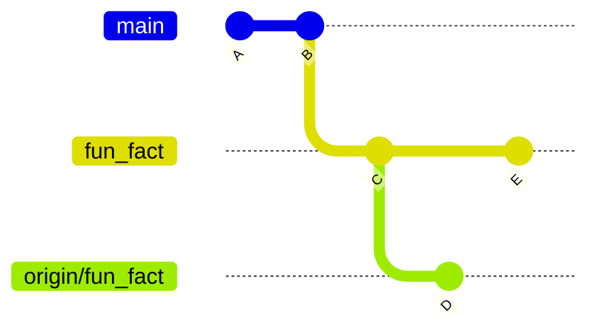

# How do branches work?

## Review

```{note}
This part of the notes is the key facts of the questions we did, not the questions, you can reivew the actual questions on Prismia
```

- `cd` with no path changes to home (`~`)
- absolute paths start with `/` or `C:\` or similar on Windows outside of bash
- absolute paths always work, like an address; relative paths are starting point specific, like directions
- `.` is a special file that references the current location, for example, we can stage all of the files in the working directory with `git add .`


## Back to the gh-inclass repo

Recall, We can move around and examine the computer's file structure using shell commands.

First we will navigate to our working directory for class that we made in the last class

+++

To confirm our current working directory we print it with `pwd`

```{code-cell} bash
:tags: ["skip-execution"]
pwd
```

```{code-block} console
/Users/brownsarahm
```

Now that we know where we are, we can move to the target location

```{code-cell} bash
:tags: ["skip-execution"]
cd Documents/inclass/systems/
```

and look at the location again to confirm it is what we expected

````{margin}
```{note}
we used a *relative* path to move from home to the target and `pwd` shows us the *absolute* path.

Knowing these types of paths is often the root of how to actually understand error messages or follow instructions.  

Using terminology like this correctly increases your ability to talk with other developers. 
```
````

```{code-cell} bash
:tags: ["skip-execution"]
pwd
```

```{code-block} console
/Users/brownsarahm/Documents/inclass/systems
```

```{tip}
In class, I demod the fact about `cd` without a path going to home and then used my built in history to repeat a command by using the {kbd}`&#8593;` key
```

Then we move into the gh inclass repo

```{code-cell} bash
:tags: ["skip-execution"]
cd gh-inclass-sp24-brownsarahm/
```


and confirm the path

```{code-cell} bash
:tags: ["skip-execution"]
pwd
```

```{code-block} console
/Users/brownsarahm/Documents/inclass/systems/gh-inclass-sp24-brownsarahm
```

## Branches do not sync automatically 


First, we will look at where we left off to refresh, then we will make a change in GitHub and see how that impacts our local copy. 


We start examining our local copy by looking at the working directory


```{code-cell} bash
:tags: ["skip-execution"]
ls
```

```{code-block} console
README.md	about.md
```
we see both files like we expected. 

```{code-cell} bash
:tags: ["skip-execution"]
git status
```

```{code-block} console
On branch 2-create-an-about-file
Your branch is up to date with 'origin/2-create-an-about-file'.

nothing to commit, working tree clean
```

and everything is logged in git. 

## Getting to GitHub from your local system

````{warning} 

This requires that you have the `gh` CLI working

It is finicky on GitBash, but if it does not work you can navigate in your browser. 

If yours did not work, but then you figure out a fix to make it work, submit that as an FAQ on the [git and github faq page](../faq/github.md) for a community badge. 
````

```{code-cell} bash
:tags: ["skip-execution"]
gh repo view --web
```


```{code-block} console
Opening github.com/compsys-progtools/gh-inclass-sp24-brownsarahm in your browser.
```

In the browser, we merged the PR we opened on Tuesday, that updates the main branch on GitHub with 2 more commits:
- the commit that was on the `2-create-an-about-file` 
- the merge commit


First we check, 

```{code-cell} bash
:tags: ["skip-execution"]
git status
```

```{code-block} console
On branch 2-create-an-about-file
Your branch is up to date with 'origin/2-create-an-about-file'.

nothing to commit, working tree clean
```

merging on GitHub does not change anythign locally

Back on our local computer, we will go back to the main branch, using `git checkout` 

```{code-cell} bash
:tags: ["skip-execution"]
git cehkout main
```

````{margin}
```{important}
Note how when I misspelled `checkout` git tried to help and told me what the most similar command to my typo was!
```
````

```{code-block} console
git: 'cehkout' is not a git command. See 'git --help'.

The most similar command is
	checkout
```

Now, I spell it correctly and actually switch

```{code-cell} bash
:tags: ["skip-execution"]
git checkout main
```

```{code-block} console
Switched to branch 'main'
Your branch is up to date with 'origin/main'.
```

It says we are up to date with `origin/main` and remember `origin` is the *name* of the {term}`remote` that is where we cloned from on GitHub.com.

Now, we look at the working directory. 

```{code-cell} bash
:tags: ["skip-execution"]
ls
```

```{code-block} console
README.md
```


the file is missing.  It said it was up to date with origin main, but that is the most recent time we checked github only.  It's up to date with our local record of what is on GitHub, not the current GitHub. 

We can also confirm that it is not hidden:

```{code-cell} bash
:tags: ["skip-execution"]
ls -a
```

```{code-block} console
.		..		.git		.github		README.md
```


## Updating Locally 

Updating locally involves 2 steps: 
- update the local repo (the .git directory with all of the commits)
- update the working directory


Next, we will update locally, with `git fetch`


```{code-cell} bash
:tags: ["skip-execution"]
git fetch
```

```{code-block} console
remote: Enumerating objects: 1, done.
remote: Counting objects: 100% (1/1), done.
remote: Total 1 (delta 0), reused 0 (delta 0), pack-reused 0
Unpacking objects: 100% (1/1), 919 bytes | 919.00 KiB/s, done.
From https://github.com/compsys-progtools/gh-inclass-sp24-brownsarahm
   faef6af..1e2a45f  main       -> origin/main
```


Here we see 2 sets of messages.  Some lines start with "remote" and other lines do not. 
The "remote" lines are what `git` on the GitHub server said in response to our request and the 
other lines are what `git` on your local computer said. 

So, here, it counted up the content, and then sent it on GitHub's side. On the local side, it unpacked (remember git compressed the content before we sent it). It describes the changes that were made on the 
GitHub side, the main branch was moved from one commit to another. So it then updates the local main branch accordingly ("Updating 6a12db0..caeacb5").


Now, again, we check the working directory 

```{code-cell} bash
:tags: ["skip-execution"]
ls
```

```{code-block} console
README.md
```


no changes yet. `fetch` updates the .git directory so that git knows more, but does not update our local file system. 

However, we can see the impact of the `fetch` using `git status`

```{code-cell} bash
:tags: ["skip-execution"]
git status
```

```{code-block} console
On branch main
Your branch is behind 'origin/main' by 2 commits, and can be fast-forwarded.
  (use "git pull" to update your local branch)

nothing to commit, working tree clean
```

Now, git knows that our local main is behind `origin/main` and by how much and tells us how to apply the changes to the local branch. 

So we do that. 


```{code-cell} bash
:tags: ["skip-execution"]
git pull
```

```{code-block} console
Updating faef6af..1e2a45f
Fast-forward
 about.md | 2 ++
 1 file changed, 2 insertions(+)
 create mode 100644 about.md
```

It applies the changes to the local directory too: 


```{code-cell} bash
:tags: ["skip-execution"]
ls
```

```{code-block} console
README.md	about.md
```

## What other tools do I have to examine things on the terminal

Lets try two more ways of looking at our repo and files. Then we will use those to learn more about working with branches. 

### Git log

We can see commits with `git log`

```{code-cell} bash
:tags: ["skip-execution"]
git log
```


this is a program, we can use enter/down arrow to move through it and then `q` to exit.

```{code-block} console
commit 1e2a45fbca5ce7bf775827f5f4dbe23b6561cff4 (HEAD -> main, origin/main, origin/HEAD)
Merge: faef6af 81c6f18
Author: Sarah Brown <brownsarahm@uri.edu>
Date:   Thu Feb 1 12:51:17 2024 -0500

    Merge pull request #4 from compsys-progtools/2-create-an-about-file
    
    create about file close s #2

commit 81c6f187f146caaaf43d97bc1bb8ed237142f4c3 (origin/2-create-an-about-file, 2-create-an-about-file)
Author: Sarah M Brown <brownsarahm@uri.edu>
Date:   Tue Jan 30 13:33:54 2024 -0500

    create about file close s #2

commit faef6af98e6bd0951ebcefb809ff4e353a0c7fbc
Author: Sarah Brown <brownsarahm@uri.edu>
Date:   Tue Jan 30 13:03:36 2024 -0500

    start readme, closes #3

commit 98cff657d25adf9a0820a04d60f6409445f70e76
Author: github-classroom[bot] <66690702+github-classroom[bot]@users.noreply.github.com>
Date:   Tue Jan 30 17:53:54 2024 +0000

    Initial commit
```

### Concatenate a file

the `cat` command *concatenates a files' contents to the terminal output (which is actually a special file called standard out or stdout)

```{code-cell} bash
:tags: ["skip-execution"]
cat about.md 
```

```{code-block} console
I like to ski

```

## Making a branch locally

```{important}
It is totally okay to test ideas out and see what happens as a way to investigate how things work.  Here we tested a few suggestions to see what works.  This lets us learn 2 things: 
- what works
- how to read error messages
```

### Checkout requires the branch to exist 

```{code-cell} bash
:tags: ["skip-execution"]
git checkout my_branchcehcekd
```

```{code-block} console
error: pathspec 'my_branchcehcekd' did not match any file(s) known to git
```
This error message says that it cannot switch because the name we gave does not already exist.  This is a good to recognize error message because this is also what would happen if you tried to switch, but spelled the branch name wrong. 

### the -b option lets checkout create a branch


```{code-cell} bash
:tags: ["skip-execution"]
git checkout -b my_branch_cehckoutb
```

```{code-block} console
Switched to a new branch 'my_branch_cehckoutb'
```
Success! 

the `-b` lets `git checkout` both create and switch to a branch

### create is not an option

```{code-cell} bash
:tags: ["skip-execution"]
git branch create example
```

```{code-block} console
fatal: not a valid object name: 'example'
```

This error message is tricky; it only complains about `example`. We could try 

```{code-cell} bash
:tags: ["skip-execution"]
git branch create 
```

this gives no response, but if we use `git branch` we would see it created a branch called `create`. 

So, back to our original attempt, is that it thinks we are asking to make a branch named `create` but then sees this extra thing `example` that it doesn't know what to do with, so blames that for the error. 

### Chaining commands together 

Finally, we tried: 

```{code-cell} bash
:tags: ["skip-execution"]
git branch my_branch; git checkout my_branch
```

```{code-block} console
Switched to branch 'my_branch'
```

This worked.  From this example, we learn a 2 things: 
- `git branch <new name>` creates a new branch
- we can put multiple commands on a "single line" using `;` between them

### We can list branches

without any {term}`argument`, we get a list of the branches that exist`

```{code-cell} bash
:tags: ["skip-execution"]
git branch
```

```{code-block} console
  2-create-an-about-file
  main
* my_branch
  my_branch_cehckoutb
```
note it also indicates which branch you are on

## Branches are pointers

We'll go back to main 

```{code-cell} bash
:tags: ["skip-execution"]
git checkout main
```

```{code-block} console
Switched to branch 'main'
Your branch is up to date with 'origin/main'.
```
and then make a new branch for the next changes we will make. 

We've used `git checkout` to switch branches before.  To also create a branch at the same time, we use the `-b` option. 

```{code-cell} bash
:tags: ["skip-execution"]
git checkout -b fun_fact
```

```{code-block} console
Switched to a new branch 'fun_fact'
```

If we use `git log` to see the commits, we can see more about the branches. 

```{code-cell} bash
:tags: ["skip-execution"]
git log
```

```{code-block} console
commit 1e2a45fbca5ce7bf775827f5f4dbe23b6561cff4 (HEAD -> fun_fact, origin/main, origin/HEAD, my_branch_cehckoutb, my_branch, main)
Merge: faef6af 81c6f18
Author: Sarah Brown <brownsarahm@uri.edu>
Date:   Thu Feb 1 12:51:17 2024 -0500

    Merge pull request #4 from compsys-progtools/2-create-an-about-file
    
    create about file close s #2

commit 81c6f187f146caaaf43d97bc1bb8ed237142f4c3 (origin/2-create-an-about-file, 2-create-an-about-file)
Author: Sarah M Brown <brownsarahm@uri.edu>
Date:   Tue Jan 30 13:33:54 2024 -0500

    create about file close s #2

commit faef6af98e6bd0951ebcefb809ff4e353a0c7fbc
Author: Sarah Brown <brownsarahm@uri.edu>
Date:   Tue Jan 30 13:03:36 2024 -0500

    start readme, closes #3

commit 98cff657d25adf9a0820a04d60f6409445f70e76
Author: github-classroom[bot] <66690702+github-classroom[bot]@users.noreply.github.com>
Date:   Tue Jan 30 17:53:54 2024 +0000

    Initial commit
```

branches are {term}`pointers` a branch points to a commit. 

Note in the above that we have different branches pointed to different commits. 


## Linking a locally created branch to a remote

Next we will edit the file so we can create a commit. 


```{code-cell} bash
:tags: ["skip-execution"]
nano about.md 
```

Add any fun fact on the line below your content.  Then, write out (save), it will prompt the file name.  Since we opened nano with a file name (`about.md`) specified, you will not need to type a new name, but to confirm it, by pressing enter/return. 


we used the [nano text editor](https://www.nano-editor.org/dist/latest/nano.html).  `nano` is simpler than other text editors that tend to be more popular among experts, `vim` and `emacs`.  Getting comfortable with nano will get you used to the ideas, without putting as much burden on your memory.  This will set you up to learn those later, if you need a more powerful terminal text editor. 

```{code-cell} bash
:tags: ["skip-execution"]
cat about.md 
```

```{code-block} console
I like to ski
I came to URI in 2020
```

My file now has 2 lines in it. 


Now we check the status

```{code-cell} bash
:tags: ["skip-execution"]
git status
```

```{code-block} console
On branch fun_fact
Changes not staged for commit:
  (use "git add <file>..." to update what will be committed)
  (use "git restore <file>..." to discard changes in working directory)
	modified:   about.md

no changes added to commit (use "git add" and/or "git commit -a")
```

Now the file is *modified* instead of what we saw before that was *untracked* 

Again we stage it first: 

````{margin}
```{tip}
Git references

- [visual cheatsheet](https://ndpsoftware.com/git-cheatsheet.html#loc=index;)
- [github cheatsheet in many languages](https://training.github.com/)
- [complete official docs](https://git-scm.com/docs)

```
````

```{code-cell} bash
:tags: ["skip-execution"]
git add about.md 
```

then look again

```{code-cell} bash
:tags: ["skip-execution"]
git status
```

```{code-block} console
On branch fun_fact
Changes to be committed:
  (use "git restore --staged <file>..." to unstage)
	modified:   about.md

```

and  commit. 

```{code-cell} bash
:tags: ["skip-execution"]
git commit -m 'add a fun fact'
```

```{code-block} console
[fun_fact 07897fd] add a fun fact
 1 file changed, 1 insertion(+), 1 deletion(-)
```

Then we push

```{code-cell} bash
:tags: ["skip-execution"]
git push
```

```{code-block} console
fatal: The current branch fun_fact has no upstream branch.
To push the current branch and set the remote as upstream, use

    git push --set-upstream origin fun_fact

To have this happen automatically for branches without a tracking
upstream, see 'push.autoSetupRemote' in 'git help config'.

```

but it fails. 

It cannot push, because it does not know where to push, like we noted above that it did not comapre to origin, that was beecause it does not have an "upstream branch" or a corresponding branch on a remote server. 

We follow git's advice 

```{code-cell} bash
:tags: ["skip-execution"]
git push --set-upstream origin fun_fact
```

```{code-block} console
Enumerating objects: 5, done.
Counting objects: 100% (5/5), done.
Delta compression using up to 8 threads
Compressing objects: 100% (2/2), done.
Writing objects: 100% (3/3), 287 bytes | 287.00 KiB/s, done.
Total 3 (delta 1), reused 0 (delta 0), pack-reused 0
remote: Resolving deltas: 100% (1/1), completed with 1 local object.
remote: 
remote: Create a pull request for 'fun_fact' on GitHub by visiting:
remote:      https://github.com/compsys-progtools/gh-inclass-sp24-brownsarahm/pull/new/fun_fact
remote: 
To https://github.com/compsys-progtools/gh-inclass-sp24-brownsarahm.git
 * [new branch]      fun_fact -> fun_fact
branch 'fun_fact' set up to track 'origin/fun_fact'.
```

and success! 


## Merge conflicts

We are going to *intentionally* make a merge conflict here. 

This means we are learning two things: 
- what *not* to do if you can avoid it
- how to fix it when a merge conflict occurs

Merge conflicts are not **always** because someone did something wrong; it can be a conflict in the 
simplest term because two people did two types of work that were supposed to be independent, but 
turned out not to be. 

To create the merge conflict we are going to edit the same branch in two different ways locally and in browser.  This couls also happen by two different people making edits to the same branch *or* more commonly, by having edits made on both the compare branch and the base branch of a PR to the same part of the same file. 

### Edit in browser


First, in your browser edit the about.md file to have a second fun fact. Commit directly to the `fun_fact` branch. 

### Edit locally

Then edit it locally to also have 2 fun facts. 


```{code-cell} bash
:tags: ["skip-execution"]
nano about.md 
```

My local version looks like this: 

```{code-cell} bash
:tags: ["skip-execution"]
cat about.md 
```

```{code-block} console
I like to ski
I came to URI in 2020
I moved to RI in 2018
```

Now we check with git

```{code-cell} bash
:tags: ["skip-execution"]
git status
```

```{code-block} console
On branch fun_fact
Your branch is up to date with 'origin/fun_fact'.

Changes not staged for commit:
  (use "git add <file>..." to update what will be committed)
  (use "git restore <file>..." to discard changes in working directory)
	modified:   about.md

no changes added to commit (use "git add" and/or "git commit -a")
```

and stage and commit

```{code-cell} bash
:tags: ["skip-execution"]
git add .
git commit -m 'another funfact'
```

```{code-block} console
[fun_fact 7985615] another funfact
 1 file changed, 1 insertion(+)
```

### Getting a conflict

Now if we try to pull the changes from GitHub.

```{code-cell} bash
:tags: ["skip-execution"]
git pull
```

```{code-block} console
remote: Enumerating objects: 5, done.
remote: Counting objects: 100% (5/5), done.
remote: Compressing objects: 100% (2/2), done.
remote: Total 3 (delta 1), reused 0 (delta 0), pack-reused 0
Unpacking objects: 100% (3/3), 938 bytes | 312.00 KiB/s, done.
From https://github.com/compsys-progtools/gh-inclass-sp24-brownsarahm
   07897fd..7e78493  fun_fact   -> origin/fun_fact
hint: You have divergent branches and need to specify how to reconcile them.
hint: You can do so by running one of the following commands sometime before
hint: your next pull:
hint: 
hint:   git config pull.rebase false  # merge
hint:   git config pull.rebase true   # rebase
hint:   git config pull.ff only       # fast-forward only
hint: 
hint: You can replace "git config" with "git config --global" to set a default
hint: preference for all repositories. You can also pass --rebase, --no-rebase,
hint: or --ff-only on the command line to override the configured default per
hint: invocation.
fatal: Need to specify how to reconcile divergent branches.
```

Now it cannot work because the branches are {term}`divergent`.  This illustrates the fact that our two versions of the branch `fun_fact` and `origin/fun_fact` are two separate things.  

diverged means like this diagram: 



Note that the `origin/fun_fact` and `fun_fact` have different histories. 


the branches have diverged means that they do not agree and that they each have at least one commit that is different from the other. 

*diverged* does not necessarily mean a conflict, sometimes we can simply change what commit has what parent and it will work. 


git gave us some options, we will use [rebase](https://git-scm.com/docs/git-rebase) which will apply our local commits *after* the remote commits. 

Rebase will try to make it like this: 

```{mermaid}
gitGraph
    commit id:"A"
    commit id:"B"

    branch fun_fact
    checkout fun_fact
    commit id:"C"
    commit id:"D'"
    checkout fun_fact
    commit id:"E'"
```

the commits `D` and `E` get modified some, the time and parent info is updated, but the changes to the content are the same. 

```{code-cell} bash
:tags: ["skip-execution"]
git pull --rebase
```

```{code-block} console
:emphasize-lines: 2

Auto-merging about.md
CONFLICT (content): Merge conflict in about.md
error: could not apply 7985615... another funfact
hint: Resolve all conflicts manually, mark them as resolved with
hint: "git add/rm <conflicted_files>", then run "git rebase --continue".
hint: You can instead skip this commit: run "git rebase --skip".
hint: To abort and get back to the state before "git rebase", run "git rebase --abort".
Could not apply 7985615... another funfact
```

It was not able to do it; beacuse both had edited the same line of the same file.  This requires a person to figure out what the content should be. 

it tells us what file the issue is in the 2nd line. 

### Resolving a merge conflict

To resolve manually, we have to edit the file.  We are going to use nano again here. 

```{code-cell} bash
:tags: ["skip-execution"]
nano about.md 
```

The file looks like this when we open it up: 

```{code-block} console
I like to ski
I came to URI in 2020
<<<<<<< HEAD
I am from NH
=======
I moved to RI in 2018
>>>>>>> 7985615
```

git added markup to the file to show us what was in each of the two versions, labeled by the HEAD pointer and the specific commit for the other. 
It puts `=` between the two.  To resolve, we edit the file to be what we want. We can choose one version, the other, or both.  We'll choose both here. 

```{code-cell} bash
:tags: ["skip-execution"]
cat about.md 
```

```{code-block} console
I like to ski
I came to URI in 2020
I am from NH
I moved to RI in 2018

```

Next, we go back to check in with git. 

```{code-cell} bash
:tags: ["skip-execution"]
git status
```

```{code-block} console
interactive rebase in progress; onto 7e78493
Last command done (1 command done):
   pick 7985615 another funfact
No commands remaining.
You are currently rebasing branch 'fun_fact' on '7e78493'.
  (fix conflicts and then run "git rebase --continue")
  (use "git rebase --skip" to skip this patch)
  (use "git rebase --abort" to check out the original branch)

Unmerged paths:
  (use "git restore --staged <file>..." to unstage)
  (use "git add <file>..." to mark resolution)
	both modified:   about.md

no changes added to commit (use "git add" and/or "git commit -a")
```

it tells us how to finish up what we were doing. 

First we commit: 


```{code-cell} bash
:tags: ["skip-execution"]
git add .
git commit -m 'resolve conflit'
```

```{code-block} console
[detached HEAD 07959c0] resolve conflit
 1 file changed, 3 insertions(+), 1 deletion(-)
```

then use the `continue` option 

```{code-cell} bash
:tags: ["skip-execution"]
git rebase --continue
```

```{code-block} console
Successfully rebased and updated refs/heads/fun_fact.
```

Finally we check in: 

```{code-cell} bash
:tags: ["skip-execution"]
git status
```

```{code-block} console
On branch fun_fact
Your branch is ahead of 'origin/fun_fact' by 1 commit.
  (use "git push" to publish your local commits)

nothing to commit, working tree clean
```

and push

```{code-cell} bash
:tags: ["skip-execution"]
git push
```

```{code-block} console
Enumerating objects: 5, done.
Counting objects: 100% (5/5), done.
Delta compression using up to 8 threads
Compressing objects: 100% (3/3), done.
Writing objects: 100% (3/3), 314 bytes | 314.00 KiB/s, done.
Total 3 (delta 1), reused 0 (delta 0), pack-reused 0
remote: Resolving deltas: 100% (1/1), completed with 1 local object.
To https://github.com/compsys-progtools/gh-inclass-sp24-brownsarahm.git
   7e78493..07959c0  fun_fact -> fun_fact
```


```{code-cell} bash
:tags: ["skip-execution"]

```


## Prepare for Next Class

```{include} ../_prepare/2024-02-01.md
```

## Badges

`````{tab-set}
````{tab-item} Review
```{include} ../_review/2024-02-01.md
```
````

````{tab-item} Practice
```{include} ../_practice/2024-02-01.md
```
````
`````

## Summary 

- branches do not synch automatically
- branches are pointers to commits
- every commit knows its parents
- if two different commits have the same parent, when we try to merge we will have divergent branches
- divergent branches can be merged by different strategies
- a merge conflict occurs if, when merging branches, a single file has been edited in two different ways

We often visualize git using graphs like subway maps: 

```{mermaid}
gitGraph
    commit id:"A"
    commit id:"B"

    branch fun_fact
    checkout fun_fact
    commit id:"C"
    commit id:"D'"
    checkout fun_fact
    commit id:"E"
```

However you can also think of what we learned today like this: 

```{mermaid}
flowchart LR
    cA[ A <br> commit]
    cB[ B <br> commit]
    cB --> |knows its parent| cA
    cC[ C <br> commit] --> |knows its parent| cB  
    blocal[fun_fact <br> branch] --> |is a pointer to| cC
    bremote[origin/fun_fact <br> branch] --> |is a pointer to| cB
```

Over the next few weeks we will keep refining this understanding. 


### New bash commands

```{list-table}
:header-rows: 1

* - command
  - explanation
* - `cat`
  - concatenate a file to standard out (show the file contents)
```


### New git commands
```{list-table}
:header-rows: 1

* - command
  - explanation
* - `git log`
  - show list of commit history
* - `git branch`
  - list branches in the repo
* - `git branch new_name`
  - create a `new_name` branch
* - `git checkout -b new_Name`
  - create a `new_name` branch and switch to it
* - `git pull`
  - apply or fetch and apply changes from a remote branch to a local branch
```


## Experience Report Evidence

run the command: 
```
git log >> makeup-2024-02-02.md
```

then `mv makeup-2024-02-02.md <rel>` where `<rel>` is the relative path from your gh incalss repo to your KWL repo. 

commit this file to the experience report branch

## Questions After Today's Class 

